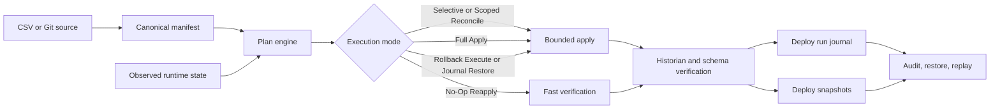

# PHX IIoT - Runtime Orchestration Layer for Ignition

> This is a public technical evidence repository.  
> The core PHX deployment engine, Ignition gateway scripts, and private orchestration logic are not published here.


Declarative runtime provisioning, governed reconciliation, and replayable deployment state for Ignition-based SCADA/MES foundations.

> "The system is not the truth. The definition is."

PHX IIoT is a runtime orchestration layer for Inductive Automation Ignition.

It enables deterministic provisioning, topology-driven deployment, historian-aware verification, governed runtime drift handling, and replayable deployment state from a structured source definition.

## Repository Map

- `_v0.0_PROOF_MEDIA/` — PoC screenshots, diagrams, architecture visuals, and runtime evidence images
- `_v0.0_EXAMPLE_PLANTS/` — safe public topology manifest examples
- `_v0.1_FIELD_APPLICATION_01_0526_PLANNED/` — planned read-only brownfield validation brief
- `.github/` — security, contribution, issue-template, and rights-boundary notes

## What PHX is

PHX is:

- a topology-driven runtime generator
- a deploy planner with explicit execution modes
- a governed reconciliation workflow for runtime drift
- a historian-aware verification layer
- a deploy journal and snapshot system for replay, restore, and audit

PHX is not:

- a PLC control engine
- a safety system
- a blind overwrite deployer
- a replacement for engineering review
- a generic dashboard builder
- a claim of fully autonomous brownfield reconciliation

## SCADA/MES-capable runtime foundation

PHX is MES-aligned and SCADA/MES-capable within the current controlled build scope.

The value is not just rapid provisioning. The value is the ability to regenerate and revalidate a known runtime foundation with journaled evidence instead of relying on manual reconstruction.

## Why this exists

Industrial runtime delivery still depends heavily on:

- manual scaffolding
- copy-paste engineering
- backup/restore habits
- runtime drift across plants
- historian inconsistencies
- undocumented deployment intent

These patterns can work, but they make repeatability, controlled recovery, and multi-site standardization harder than they should be.

PHX explores a narrower question:

Can an Ignition runtime foundation be treated more like software-defined industrial infrastructure, where the source definition, observed runtime state, and governance policy are all visible before applying change?

## Concept videos

### Full Topology Rebuild — Phoenix Phase

- Rebuild Provisioning Layer: https://youtu.be/BU7qWBIWs_4
- Rebuild Provisioning and Reconciliation Layer: https://youtu.be/VquVNYi_Z9U

### Rapid, High-Scale Foundation — Icarus Phase

- Tag Burst Provisioning: https://youtu.be/Ci-ngGc4NF8

## Architecture at a glance



## Core principle

```text
Same source definition
+ same observed runtime state
+ same governance policy
= same governed runtime result
```

The purpose is not only to generate tags faster.

The purpose is to make runtime foundation changes more explicit, repeatable, reviewable, and recoverable.

## Supported capabilities

### 1. Deterministic manifest and identity layer

- Canonical manifest CRC and source checksums
- Stable asset identity from explicit GUIDs or path + OPC fingerprints
- Runtime planning before apply
- Last-deploy baseline retention for replayable comparisons

### 2. Execution modes

PHX models deploy behavior through explicit execution modes, including:

- Full Apply
- No-Op Reapply
- Idempotent Reconcile
- Selective Reconcile
- Scoped Reconcile
- Rollback Execute
- Journal Restore
- Exception Reconcile for governed exception paths

### 3. Governed reconciliation

When runtime and definition diverge, PHX can intentionally stop the apply path and require a typed decision instead of silently overwriting the runtime.

Supported decision patterns include:

- Revert runtime to definition
- Promote runtime to definition
- Keep as exception
- Defer decision and preserve pending state

This is deliberate.

`BLOCKED` is treated as a valid orchestration state, not just an unhandled failure.

### 4. Historian-aware verification

PHX does not stop at tag creation.

The verification path checks:

- topology invariants
- management schema readiness
- historian runtime vs expected footprint
- unmapped or legacy historian residue
- source integrity state before declaring a run ready

### 5. Replayable deploy journal

Deploys are tracked as orchestration runs with explicit states such as:

- `PLANNED`
- `PREPARE`
- `APPLYING`
- `VERIFYING`
- `READY`
- `PARTIAL`
- `BLOCKED`
- `DEFERRED`
- `FAILED`
- `ROLLING_BACK`
- `ROLLED_BACK`

Each run can carry source metadata, rollback ancestry, contract status, invariant summaries, and timing data.

### 6. Snapshot-backed recovery and audit

PHX persists run snapshots such as:

- `SOURCE_ROWS`
- `PRE_APPLY_RUNTIME`
- `FAST_NOOP_SUMMARY`
- `POST_APPLY_SUMMARY`

This allows headless flows and UI flows to speak the same deploy language.

### 7. Source governance

PHX supports controlled source behavior across different deployment modes:

- Git-managed flows can enforce source-of-truth locking
- CSV-driven flows are intentionally operator-switchable
- Rollback paths can bypass source lock when needed for recovery

## Minimum viable SCADA/MES runtime foundation

Beyond orchestration, PHX already includes the core components of a minimum viable Ignition-based SCADA/MES runtime foundation within the current controlled build scope:

- generated ISA-95 equipment hierarchy and OPC-connected runtime tags
- historian-backed time-series collection and trend queries
- alarm generation, acknowledge, and clear workflows
- asset-level KPI and OEE calculation
- shift-level aggregation and summary reporting
- Perspective dashboards for plant overview, trends, analytics, and shift views
- controlled deploy, wipe, restore, and reconciliation workflows with auditability

Taken together, this makes PHX more than a provisioning engine.

Within the current PHX build scope, it functions as a minimum viable Ignition-based SCADA/MES runtime foundation for machine monitoring, historian-backed reporting, alarm handling, KPI tracking, and shift-aware operational visibility.

## Verified evidence in the current PHX build

The current evidence is intentionally narrow and measured.

- Fresh deploy observed in the current Perspective development client on 2026-04-26: 10 assets, 430 tags, 31.4 seconds
- Drift-corrective apply observed in the same session: 10 assets, 430 tags, 12.1 seconds
- Determinism proof: a 20-asset manifest was generated 3 times with identical CRC32 `1C2C3848` and identical SHA-256 `AC71B07BF45B1C5C44CB15C6F0342DF56672EA84F7AD9D9E606353E119436B26`

The goal of the repo is not to inflate scale claims.

The goal is to show that orchestration behavior can be repeatable, explainable, and inspectable within a controlled Ignition environment.

## Brownfield position

For brownfield systems, PHX should be read conservatively.

The near-term value is not automatic self-healing SCADA.

The safer promise is:

- read-only runtime inventory
- candidate manifest generation
- semantic drift visibility
- governed migration or reconciliation planning before mutation

That makes PHX useful even before full write-path authority is acceptable.

## Engineering Trials: Controlled Chaos Experiments

PHX also includes an engineering trial track designed to map system behavior under increasing OT/IT stress, drift pressure, and recovery complexity.

This section is intentionally broader than the verified evidence section above. It includes completed trials, planned failure research, and longer-horizon vision items.

The purpose of these trials is not only performance testing. It is to make failure modes, scale limits, recovery behavior, and orchestration boundaries visible.

- **[DONE] Test #1 — Full Topology Rebuild**  
  Idempotency proof, one-click rebuild in seconds, hot-patching.  
  *(Phoenix Phase)*

- **[DONE] Test #2 — Tag Burst Provisioning**  
  Observed historian write degradation around ~2,700 tags/sec during ~30k tag provisioning tests.  
  *(Icarus Phase)*

- **[PLANNED] Test #3 — Subscription Storm**  
  Gateway memory collapse threshold under mass OPC UA subscriptions.  
  *(Connection Storm Phase)*

- **[PLANNED] Test #4 — DB Overweight / Max IO Scope**  
  Maximum database writes with simulated disk errors.  
  *(Atlas Phase)*

- **[PLANNED] Test #5 — Connection Loss Matrix**  
  Every failure combination: partial loss, flapping, timeout cascades.  
  *(Hades Phase)*

- **[PLANNED] Test #6 — Machine to Capital Impact Tracing**  
  Data path from machine sensor to financial loss number.  
  *(Daedalus Phase)*

- **[VISION] Test #7 — Predictive Intelligence Engine**  
  ML layer on top of the IaC stack.  
  *(Artemis Phase)*

- **[VISION] Test #8 — Built-In PLC Simulator and Playground**  
  Embedded PLC simulation environment for CI loops.  
  *(Prometheus Phase)*

## What PHX does not claim

PHX does not currently claim:

- full plant autonomy
- replacement of SCADA engineering judgment
- guaranteed failure-atomic rollback under every fault profile
- historian continuity guarantees under all startup and wipe conditions
- replacement of control, alarm, or safety authority
- one-click brownfield write-back without review

## Roadmap themes

- richer brownfield runtime observability
- stronger policy and approval workflows
- broader restore and checkpoint coverage
- clearer topology and historian governance visualization
- safer multi-source model governance
- higher-confidence headless validation flows

## PHX Role Impact

PHX plays a combined industrial runtime role closest to **Terraform + Kubernetes/ArgoCD**, with **Grafana/Prometheus-like observability surfaces**, adapted to Ignition-based SCADA/MES foundations.

This is not a direct replacement claim. The comparison is about role coverage:

- **Terraform-like:** source-defined provisioning and reproducible runtime materialization
- **Kubernetes/ArgoCD-like:** runtime state convergence, reconciliation, drift handling, and controlled recovery
- **Grafana-like:** topology-aware runtime surfaces and visual operational context
- **Prometheus-like:** runtime verification signals, operational evidence, and state observability

## Summary

PHX IIoT is not trying to be "SCADA, but prettier."

It is a runtime orchestration and governance layer that brings planning, replay, audit, bounded drift correction, and controlled state convergence into Ignition-based industrial foundations.

> **“Kubernetes reconciles workload state.”**
>
> **“PHX reconciles industrial meaning in SCADA runtimes — for profitability.”**
